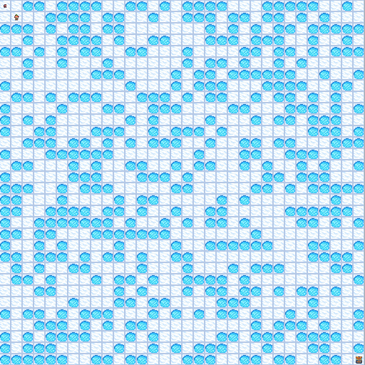
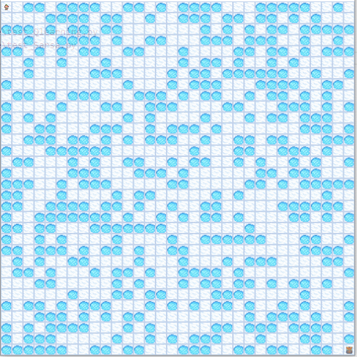

# Reinforcement Learning Tutorial

> with Python, Gynasium, and Pytorch

## Refer

- [Gymnasium (Deep) Reinforcement Learning Tutorials](https://www.youtube.com/playlist?list=PL58zEckBH8fCt_lYkmayZoR9XfDCW9hte)
- [Gymnasium](https://gymnasium.farama.org/)

## FrozenLake

You can already run the test code on pretrained Q table.

```shell
python .\code\FrozenLake\test_Qlearning.py
python .\code\FrozenLake\test_Sarsa.py 
```

| Qlearning | Sarsa |
| :-------: | :---: |
|  |  |

Or you can train the model by yourself.

```shell
python .\code\FrozenLake\train_Qlearning.py
python .\code\FrozenLake\train_Sarsa.py
```
