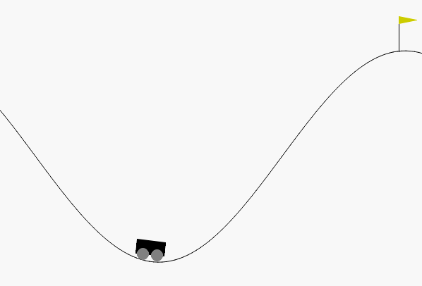
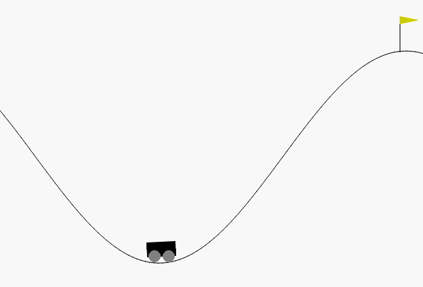

# Reinforcement Learning Tutorial

> Minimal, clean and simple reinforcement learning tutorial with `gymnasium`, `numpy` and `torch`.

## Refer

- [Gymnasium (Deep) Reinforcement Learning Tutorials](https://www.youtube.com/playlist?list=PL58zEckBH8fCt_lYkmayZoR9XfDCW9hte)
- [Gymnasium](https://gymnasium.farama.org/)
- the original code document of `gymnasium`

## FrozenLake

> intro see `gymnasium.envs.toy_text.frozen_lake`

You can already run the test code on pretrained Q table.

```shell
python .\code\FrozenLake\test_Qlearning.py
python .\code\FrozenLake\test_Sarsa.py 
```

| Qlearning | Sarsa |
| :-------: | :---: |
|  |  |

Or you can train the model by yourself.

```shell
python .\code\FrozenLake\train_Qlearning.py
python .\code\FrozenLake\train_Sarsa.py
```

## MountainCar

> intro see `gymnasium.envs.classic_control.mountain_car`

```shell
python .\code\MountainCar\test_Qlearning.py
python .\code\MountainCar\test_Sarsa.py 
```

| Qlearning | Sarsa |
| :-------: | :---: |
|  |  |

## CartPole

> intro see `gymnasium.envs.classic_control.cartpole`

```shell
python .\code\CartPole\test_Qlearning.py
python .\code\CartPole\test_Sarsa.py 
```